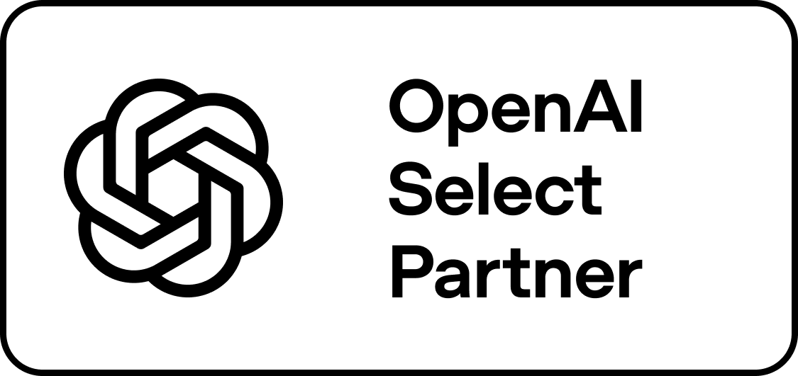

# 2SD Technologies

**Exemplify Excellence**

A strategic technology partner for AI-first enterprises -- building, deploying and scaling
systems that reach production.

We are a global company, delivering AI, cloud and data engineering across three continents for clients in healthcare, financial services, retail, logistics and the public sector.

[2sdtechnologies.com](https://2sdtechnologies.com/?utm_source=github&utm_medium=readme&utm_campaign=org-profile)

2SD Technologies is an **OpenAI Select Partner**, part of the OpenAI Partner Network.
[Learn more about the network ->](https://openai.com/business/partners/)

---

## yOGI Neural Grid

yOGI is our platform: nineteen interconnected AI applications sharing one substrate. Each app
is independently deployable, but they read and write through a common semantic layer rather
than point-to-point -- so the identity model, audit trail and policy layer are inherited rather
than rebuilt for every adoption.

That is the whole argument for a grid over point solutions: **the second app costs a fraction
of the first.**

[Explore the grid ->](https://2sdtechnologies.com/platform?utm_source=github&utm_medium=readme&utm_campaign=org-profile)

### Open Knowledge Format

The semantic layer is OKF -- portable markdown nodes with structured front-matter. Knowledge is
readable by humans, diffable in git, and consumable by agents without a bespoke integration per
system.

---

## yOGI Neural Grid Private Models

**AI for the places that cannot adopt ungoverned AI.**

Model serving inside the customer's own boundary. Purpose-trained algorithms run on-premise or
in private cloud with no external dependencies, so data does not leave the environment.

| | |
|---|---|
| **Deploy in your perimeter** | On-premise and private cloud deployment. Data does not leave your environment. |
| **Cloud-agnostic** | AWS, Azure, GCP or on-premises, with consistent behaviour regardless of infrastructure. |
| **Purpose-trained models** | Algorithms trained for specific enterprise tasks rather than general-purpose LLM calls. |

Built for CISOs, heads of data governance, and regulated-industry CIOs -- the teams for whom
"send it to a public API" was never an option.

We also build the models themselves: adapted to one job by fine-tuning or distillation, tested
against questions agreed with the people who will use it (including the ones it should refuse),
and run air-gapped. [Modelling and Intelligence as a Service ->](https://2sdtechnologies.com/ai-as-a-service?utm_source=github&utm_medium=readme&utm_campaign=org-profile)

---

## yOGI Neural Grid DocQA

**Document Q&A that will not answer without a source.**

Every answer carries a quote that has been checked, word by word, against the passage it cites --
in code, after the model has replied. If a quote is not really there, the sentence does not
count; if too little of the answer survives, it is withheld and the user is told why. Document,
section and page come from our own index, never from anything the model wrote.

It answers with a private, air-gapped model, and permissions are applied inside the search, so a
passage someone is not cleared for never reaches the model.

[How it works ->](https://2sdtechnologies.com/insights/private-document-qa-2026?utm_source=github&utm_medium=readme&utm_campaign=org-profile)

---

## yOGI Neural Grid Ally

**Accessibility testing for the documents customers actually receive.**

Statements, renewals and letters mostly live as AFP, PostScript and PCL print files rather than
web pages. Ally reads them as they are and produces large print, a
tagged accessible PDF, accessible HTML, narrated audio, braille and an early sign-language
version from one content model. Then it re-measures what it produced -- the font sizes on the
page, the contrast, every word accounted for, the PDF tagging -- and keeps the scorecard as
evidence for an EAA, EN 301 549, Section 508 or WCAG 2.2 conformance file. It is evidence, not a
certificate: a human accessibility review still belongs in the workflow.

Private and air-gapped, inside your boundary.

[How it works ->](https://2sdtechnologies.com/insights/document-accessibility-testing-2026?utm_source=github&utm_medium=readme&utm_campaign=org-profile)

---

## yOGI Neural Grid TAI

**Test cases generated from the requirement, not transcribed from it.**

A requirement describes a state and a rule evaluated at a single instant, because a sentence has
one tense. Real systems have two instants and often many more. TAI generates cases from
requirements, user stories and existing code -- including the ones nobody writes by hand,
because they live in the gap a sentence has no room for.

Five engines report into one signal bus -- web, API, performance, security and document compare
-- so a failure is attributed once rather than argued about across three teams. When the
interface moves, scripts heal, and an uncertain heal fails loudly instead of selecting the
nearest match. What fails lands in the tracker the developers already work in.

It runs inside the customer's own tenancy, and that is a governance position rather than a
deployment preference: a testing tool sits on production-shaped data, which lives in the part of
an estate that sits outside the controls protecting production.

| | |
|---|---|
| **Identity** | Single sign-on through the identity provider you already run. |
| **Authorisation** | Access by role, not by whoever has the URL. |
| **Tenancy** | Complete separation between organisations; application data does not leave yours. |
| **Evidence** | An audit trail of who ran what, when, and what it touched. |

Nothing is metered per user, per test or per token, so the cost of testing does not rise with how
much testing you do.

[The access-model argument, at length ->](https://dev.to/2sdtechnologiesdotcom/your-test-environment-is-where-the-governance-stops-4978)

### Five questions to ask any AI testing vendor

Including us. Take these and use them on everyone in the category -- a vendor who answers all
five without hedging tells you more than any demo, and one who cannot tells you sooner.

1. **When a test heals, how do I see what changed?** A heal nobody reviews is a silent pass. The
   healed selector has to be in the report.
2. **What does it do when it is not sure?** Guessing quietly is worse than failing loudly. Ask to
   see the low-confidence case.
3. **Where does our application data go, and who can see it?** Test data is production-shaped. Ask
   where it is processed and how long it is kept.
4. **If we stop paying, what do we keep?** Ask whether the generated tests are portable, or
   whether they only run inside the tool.
5. **Will you run it on our application, not your demo app?** Demo applications are built to pass.
   Yours is not. This is the only question that settles the other four.

We will answer all five on a call, against your application: info@2sdtechnologies.com

### What a walkthrough covers

If you would rather see it than read about it, bring a requirement your team actually wrote and
we will run it against your own application rather than a demo of ours. Four things, about an
hour, nothing to sign.

| | |
|---|---|
| **One of your own requirements** | Cases generated from a story your team wrote, not from a sample we prepared. |
| **What you would not have written** | The combinations the generator adds, set beside the three a person writes by hand. |
| **A deliberate change** | We rename something in the interface and run the same journey again, so you can see the relocation and the report it leaves. |
| **Your pipeline** | What it takes to run this where your builds already run. |

### The whole of it on one page

There are no percentages on it. We have not measured any we would be comfortable standing behind,
so the space is left empty rather than filled.

---

## How we build

- **API-first.** Every capability is exposed through documented APIs. If it cannot be called, it
  is not finished.
- **Deployment-agnostic.** AWS, Azure, GCP or on-premises, with consistent behaviour across all
  four.
- **Governed by default.** Zero-trust architecture, end-to-end encryption, and an audit trail
  that exists before anyone asks for it.
- **Agent-ready.** MCP for tool access, OKF for context. Agents reach systems through governed
  interfaces, not scraped ones.

**Certifications:** SOC 2 Type II | ISO 27001 | ISO 9001 | GDPR

---

## Engineering writing

We publish what we learn, including the parts that did not work.

- [We stopped trusting our model's citations, so we check them in code](https://dev.to/2sdtechnologiesdotcom/we-stopped-trusting-our-models-citations-so-we-check-them-in-code-3j0a)
- [A document assistant that won't answer without a source](https://2sdtechnologies.com/insights/private-document-qa-2026?utm_source=github&utm_medium=readme&utm_campaign=org-profile)
- [Accessibility testing for the documents your customers actually receive](https://2sdtechnologies.com/insights/document-accessibility-testing-2026?utm_source=github&utm_medium=readme&utm_campaign=org-profile)
- [How do you decide two buttons are the same button?](https://dev.to/2sdtechnologiesdotcom/how-do-you-decide-two-buttons-are-the-same-button-3ip7)
- [Five test tools, five dashboards, and nobody can say what happened](https://dev.to/2sdtechnologiesdotcom/five-test-tools-five-dashboards-and-nobody-can-say-what-happened-140f)
- [Your test environment is where the governance stops](https://dev.to/2sdtechnologiesdotcom/your-test-environment-is-where-the-governance-stops-4978)
- [The bug your requirements cannot contain](https://dev.to/2sdtechnologiesdotcom/the-bug-your-requirements-cannot-contain-3gig)
- [Generating test cases is the easy part](https://dev.to/2sdtechnologiesdotcom/generating-test-cases-is-the-easy-part-2l3a)
- [Model Context Protocol: a practical guide for the enterprise](https://2sdtechnologies.com/insights/model-context-protocol-enterprise-guide-2026?utm_source=github&utm_medium=readme&utm_campaign=org-profile)
- [MCP and APIs: why agents need more than endpoints](https://2sdtechnologies.com/insights/mcp-vs-apis-agent-integration-2026?utm_source=github&utm_medium=readme&utm_campaign=org-profile)
- [Building an Agentforce service agent: a field walkthrough](https://2sdtechnologies.com/insights/salesforce-agentforce-service-agent-build-2026?utm_source=github&utm_medium=readme&utm_campaign=org-profile)
- [Salesforce Data Cloud: how customer data actually gets unified](https://2sdtechnologies.com/insights/salesforce-data-cloud-unifying-customer-data-2026?utm_source=github&utm_medium=readme&utm_campaign=org-profile)

[All insights ->](https://2sdtechnologies.com/insights?utm_source=github&utm_medium=readme&utm_campaign=org-profile)

---

## Working with us

We take on AI, cloud and data engagements from architecture review through to production
support, and we are hiring engineers who like systems that have to actually run.

- [Careers](https://2sdtechnologies.com/careers?utm_source=github&utm_medium=readme&utm_campaign=org-profile)
- [Contact](https://2sdtechnologies.com/contact?utm_source=github&utm_medium=readme&utm_campaign=org-profile)
- info@2sdtechnologies.com

2SD Technologies Limited | Global delivery across three continents | Exemplify Excellence
